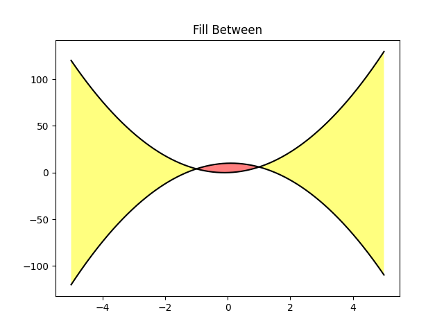

```python
import matplotlib.pyplot as plt
import numpy as np

x = np.arange(-5, 5, 0.01)
y1 = -5*x*x + x + 10
y2 = 5*x*x + x

fig, ax = plt.subplots()
ax.plot(x, y1, x, y2, color='black')
ax.fill_between(x, y1, y2, where=(y2 > y1), facecolor='yellow', alpha=0.5)
ax.fill_between(x, y1, y2, where=(y2 <= y1), facecolor='red', alpha=0.5)
ax.set_title('Fill Between')

plt.show()
```




cf.
- [https://matplotlib.org/gallery/pyplots/whats_new_98_4_fill_between.html#sphx-glr-gallery-pyplots-whats-new-98-4-fill-between-py](https://matplotlib.org/gallery/pyplots/whats_new_98_4_fill_between.html#sphx-glr-gallery-pyplots-whats-new-98-4-fill-between-py)
- `import matplotlib; matplotlib.axes.Axes.fill_between`
