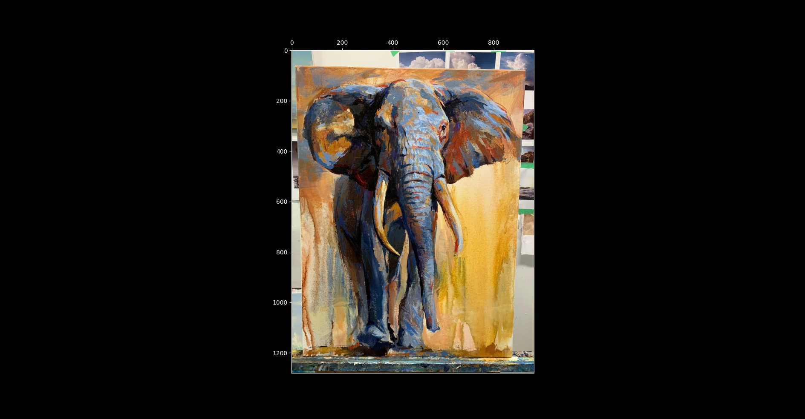

## Q&A
1. Q: How to `plt.imshow()` with computer-vision-like xtick and ytick? A:
  - `plt`: Use `plt.ylim()` and `plt.tick_params()`
     ```python
     In [52]: A = plt.imread("images/elephant.jpg")
     
     In [53]: plt.imshow(A)
     Out[53]: <matplotlib.image.AxesImage at 0x7fc8e2debdf0>
     
     In [54]: plt.ylim([A.shape[0], 0])
     Out[54]: (1280.0, 0.0)
     
     In [55]: plt.tick_params(labeltop=True, labelbottom=False, top=True, bottom=False)
     
     In [56]: plt.show()
     ```
     Result:
     


