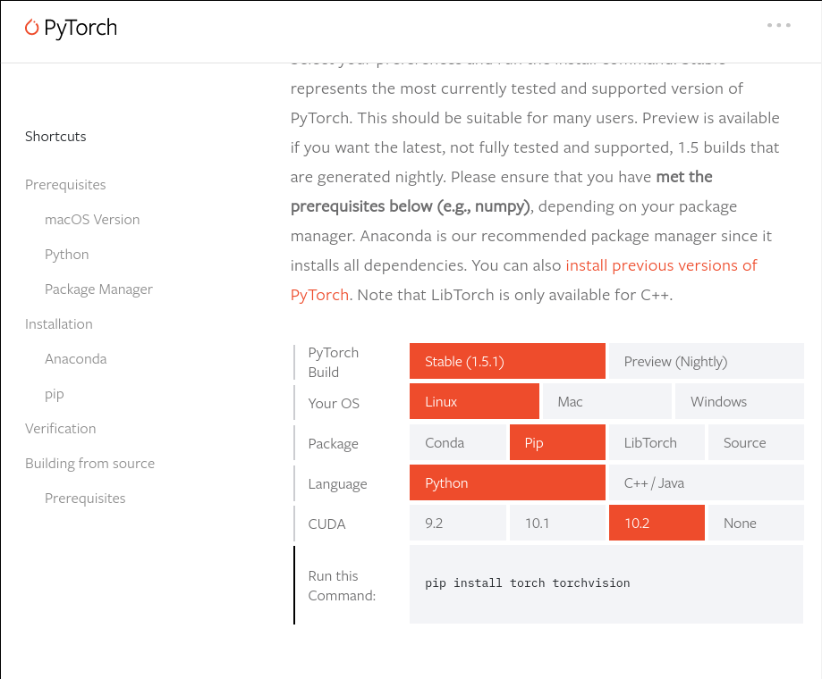

# Why This Repo?
The purpose of this repo is to help others <b>set up the environment</b> for running pytorch with <code><b>apex</b></code> and nothing more.

Besides, the advices here are only applicable for those who have similar machines or configurations like myself, namely: (Consequently, as of <code><b>2020/07/09</b></code>, the following method works for me, but, as time goes by, it may wear out and no longer be valid.)
- <code><b>linux</b></code>, be it <code>arch linux</code>, <code>ubuntu</code>, <code>gentoo</code>, etc. I think all work
- <code><b>nvcc -V</b></code> shows version <code><b>10.0</b></code> (To be more precise, mine is <code>V10.0.130</code>)
- <code><b>nvidia-smi</b></code> shows CUDA version <code><b>10.2</b></code>

Fore more information about <code>apex</code>, please refer to [https://github.com/NVIDIA/apex](https://github.com/NVIDIA/apex).

## First thing first
So far I only succeeded in installing <code>apex</code> locally on my machine inside a python virtualenv. The docker way may work the same or not. If I succeed in building or downloading a workable docker image, I shall update here.

## So, the local way
I assume the reader knows how to use python virtualenv, which is an essential piece of knowledge when coding in python. For those who don't, they may google it or pyimagesearch seems to be a good source.

As of <code><b>2020/07/09</b></code>, if, like me at first, you read <code>apex</code>'s github page and was informed that pytorch should be installed <b>before</b> <code>apex</code>, you might happily create a new virtualenv, say <code>torch1.5.0</code>, and then you go to pytorch's official website to check the command for installation. At the time of writing, the webpage is like this:

Since
<pre>
$ nvidia-smi
Thu Jul  9 11:47:04 2020
+-----------------------------------------------------------------------------+
| NVIDIA-SMI 440.95.01    Driver Version: 440.95.01    CUDA Version: 10.2     |
|-------------------------------+----------------------+----------------------+
| GPU  Name        Persistence-M| Bus-Id        Disp.A | Volatile Uncorr. ECC |
| Fan  Temp  Perf  Pwr:Usage/Cap|         Memory-Usage | GPU-Util  Compute M. |
|===============================+======================+======================|
|   0  GeForce GTX 107...  On   | 00000000:01:00.0  On |                  N/A |
| N/A   47C    P8     7W /  N/A |    293MiB /  8119MiB |      0%      Default |
+-------------------------------+----------------------+----------------------+

+-----------------------------------------------------------------------------+
| Processes:                                                       GPU Memory |
|  GPU       PID   Type   Process name                             Usage      |
|=============================================================================|
|    0      1346      G   /usr/lib/xorg/Xorg                            26MiB |
|    0      1640      G   /usr/bin/gnome-shell                          48MiB |
|    0      2411      G   /usr/lib/xorg/Xorg                           105MiB |
|    0      2566      G   /usr/bin/gnome-shell                          98MiB |
+-----------------------------------------------------------------------------+
</pre>
you follow the chart, choose <b>CUDA 10.2</b> and <code><b>pip install torch torchvision</b></code> under your <code>torch1.5.0</code> virtual environment.

Then following the instructions on <code>apex</code>'s github (the <b>Quick Start</b> section), you
<pre>
(torch1.5.0) ~ $ git clone https://github.com/NVIDIA/apex
(torch1.5.0) ~ $ cd apex
(torch1.5.0) apex $ pip install -v --no-cache-dir --global-option="--cpp_ext" --global-option="--cuda_ext" ./
</pre>

The stdout of your terminal might instantaneously spits out a lot of words and you may soon find out you have failed the installation. The most valuable piece of information from the std might be the following:

<pre>
RuntimeError: Cuda extensions are being compiled with a version of Cuda that does not match the version used to compile Pytorch binaries.  Pytorch binaries were compiled with Cuda 10.2.
In some cases, a minor-version mismatch will not cause later errors:  https://github.com/NVIDIA/apex/pull/323#discussion_r287021798.  You can try commenting out this check (at your own risk).
</pre>

You may go to the given [https://github.com/NVIDIA/apex/pull/323#discussion_r287021798](https://github.com/NVIDIA/apex/pull/323#discussion_r287021798) to see if you could find another solution. Or you may continue to read about one solution in what follows.

## What Happened?
If you check into the <code><b>setup.py</b></code> code, which is related to the long, intimidating <code>pip</code> command. You may find out that the code checks consistency of two versions:
- One being <code><b>nvcc -V</b></code>, which in our case is <code><b>10.0</b></code>
- The other being <code><b>torch.versoin.cuda</b></code> which in our case is <code><b>10.2</b></code> because we <b>chose</b> that, remember? (cf. the fig above)

So, here's one solution: <b>Install pytorch with CUDA 10.0</b>.
 
In my case, I've found this, quite standard command, from the [Internet](https://varhowto.com/how-to-install-pytorch-with-cuda-10-0/), <code><b>pip install torch==1.4.0+cu100 torchvision==0.5.0+cu100 -f https://download.pytorch.org/whl/torch_stable.html</b></code>. What left is only to repeat the installation of <code>apex</code>.

## Recap
<pre>
~ $ mkvirtualenv torch1.4.0
(torch1.4.0) ~ $ pip install torch==1.4.0+cu100 torchvision==0.5.0+cu100 -f https://download.pytorch.org/whl/torch_stable.html
(torch1.4.0) ~ $ cd apex
(torch1.4.0) apex $ pip install -v --no-cache-dir --global-option="--cpp_ext" --global-option="--cuda_ext" ./
</pre>

For me this works. Hope the same or similar modifications help you set up <code>apex</code> on your machine.

